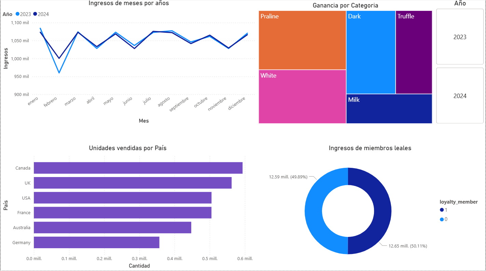

# 🍫 Data Analytics: Rendimiento de Ventas Internacionales

Este proyecto demuestra un ciclo completo de análisis de datos (Proceso ETL y Visualización) para una empresa multinacional ficticia de chocolates con un volumen de +1 millón de transacciones. 

El objetivo principal es identificar los motores de rentabilidad, el comportamiento de los clientes VIP y la distribución geográfica del volumen de ventas para apoyar la toma de decisiones estratégicas.

## 🛠️ Herramientas Utilizadas
* **Python (Pandas):** Extracción, limpieza y transformación de datos (ETL). Cruce de múltiples bases de datos transaccionales, de catálogo y de clientes (`Merge`).
* **Power BI:** Modelado de datos y creación del dashboard interactivo.

## 📊 Hallazgos Clave del Negocio
A través del análisis, se dio respuesta a preguntas críticas para la gerencia:
1. **Rentabilidad por Categoría:** Se descubrió que la categoría *Praline* es el verdadero motor financiero de la empresa, generando la mayor ganancia neta absoluta ($2.66M).
2. **Impacto del Club de Lealtad (VIP):** Se cuantificó la proporción exacta de ingresos generada por los miembros exclusivos frente a los clientes regulares, revelando que el producto favorito de este segmento es el *Dark Chocolate 50%*.
3. **Volumen Geográfico:** *Canadá* lidera la tracción del mercado global en volumen de unidades físicas movidas.
4. **Tendencia Histórica:** Análisis de los picos de ingresos (`revenue`) comparando los ciclos de ventas mensuales entre 2023 y 2024.
